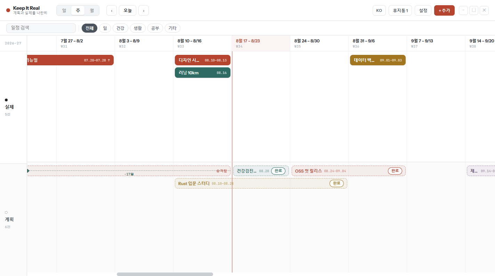

# Keep It Real

계획한 일정과 실제로 일어난 일을 한 화면 위아래에 나란히 놓고, 그 차이를 눈으로 확인하는
로컬 전용 데스크탑 플래너입니다. 계정도 서버도 없고 네트워크 요청도 하지 않습니다. 모든
기록은 앱을 실행한 기기에만 남습니다.



## 무엇을 하는 앱인가요

- **위쪽 트랙(실제)** 에는 실제로 일어난 일이, **아래쪽 트랙(계획)** 에는 하려고 했던 일이
  올라갑니다. 두 트랙은 하나의 가로 시간축을 공유하므로 같은 날짜가 항상 같은 위치입니다.
- 계획을 마쳤으면 계획 막대의 **완료** 를 누릅니다. 실제 트랙에 복사본이 생기고 계획 원본은
  날짜까지 그대로 남습니다. 계획보다 며칠 빨랐는지 늦었는지가 두 막대 사이에 선으로
  표시됩니다. 8월에 하려던 일을 7월에 끝냈다면 그 17일이 그대로 보입니다.
- 일 / 주 / 월 단위로 확대 축소할 수 있고, 이동은 가로 스크롤입니다.
- 일정을 지우면 휴지통으로 갑니다. 휴지통에서 한 번 더 지워야 완전히 사라집니다.
- 카테고리(일, 건강, 생활, 공부, 기타)는 이름과 색을 바꾸고 추가하거나 지울 수 있습니다.
- 한국어와 English를 오가며 쓸 수 있습니다.

## 요구 사항

| 항목 | 버전 |
|---|---|
| Node.js | 22.12 이상 (Node 24에서 개발 및 확인) |
| npm | 10 이상 |
| OS | Windows 10/11, macOS, Linux |

창 최소 크기는 960 x 600 입니다. 그 아래로는 줄어들지 않습니다.

## 설치하고 실행하기

```bash
git clone https://github.com/joshephan/keep-it-real.git
cd keep-it-real
npm install
npm run dev
```

잠시 뒤 앱 창이 뜹니다. 첫 실행은 일정이 하나도 없는 빈 캘린더입니다. 화면을 채워 놓고
둘러보고 싶다면 **설정 → 데이터 → 샘플 데이터 불러오기** 를 누르세요. 기존 일정을 덮어쓰는
동작이라 확인을 위해 한 번 더 눌러야 실행되고, 오늘 날짜를 기준으로 예시 일정이 들어옵니다.

개발 서버 없이 빌드된 번들로 실행하려면:

```bash
npm start
```

## 설치 파일 만들기

내 컴퓨터에 정식으로 설치해 두고 쓰려면 실행 파일을 만듭니다. 결과물은 `release/` 에
생깁니다.

```bash
npm run dist         # 지금 사용 중인 OS용
npm run dist:win     # Windows 설치 파일 (NSIS)
npm run dist:mac     # macOS dmg
npm run dist:linux   # Linux AppImage
```

각 OS의 패키지는 그 OS에서 만드는 것이 가장 확실합니다. 코드 서명을 하지 않았으므로 설치할
때 Windows SmartScreen 이나 macOS Gatekeeper 경고가 나올 수 있습니다. 직접 빌드한
파일이라면 그대로 진행하면 됩니다.

## 사용법

| 하고 싶은 것 | 방법 |
|---|---|
| 시간축 이동 | 빈 곳을 잡고 드래그, 마우스 휠, `‹` `›` (한 화면의 80%), **오늘** 버튼 |
| 일정 추가 | 원하는 트랙의 아무 칸이나 클릭 (그 날짜로 열립니다) 또는 **+ 추가** |
| 일정 수정 | 막대 클릭. 계획과 실제 모두 같은 창을 씁니다 |
| 기간으로 만들기 | 일정 창에서 **하루** 버튼을 눌러 **기간** 으로 바꾸면 종료일이 열립니다 |
| 계획을 실제로 올리기 | 계획 막대의 **완료** → 실제 시작일과 종료일 확인 → **승격하기** |
| 승격 되돌리기 | 그 계획을 다시 열어 **승격 되돌리기** |
| 일정 삭제 | 일정 창의 **휴지통으로**. 완전히 지우려면 휴지통에서 **완전 삭제** |
| 검색과 필터 | 상단 검색창과 카테고리 칩. 조건에 맞지 않는 일정은 사라지지 않고 흐려집니다 |
| 카테고리 편집 | **설정 → 카테고리**. 색 칩을 눌러 색을, 이름은 바로 입력, `✕` 로 삭제 |
| 언어 변경 | 상단 **KO / EN** 또는 **설정 → 언어** |
| 창 닫기 | 상단 오른쪽 끝 `✕` (창 테두리가 없는 대신 앱이 직접 그립니다) |

제목은 필수가 아닙니다. 제목이나 메모 중 하나만 채워도 저장되고, 제목이 없으면 메모 첫
줄이 막대에 표시됩니다.

## 내 기록은 어디에 저장되나요

JSON 파일 하나입니다. 백업이나 다른 컴퓨터로 옮기기는 이 파일을 복사하면 끝납니다.

| OS | 경로 |
|---|---|
| Windows | `%APPDATA%\Keep It Real\keep-it-real.json` |
| macOS | `~/Library/Application Support/Keep It Real/keep-it-real.json` |
| Linux | `~/.config/Keep It Real/keep-it-real.json` |

일정, 카테고리, 언어, 표시 설정이 여기 들어갑니다. 저장은 변경이 일어날 때마다 임시 파일에
쓴 뒤 바꿔치기하는 방식이라, 저장 중에 앱이 꺼져도 파일이 반쯤 쓰인 상태로 남지 않습니다.

**데스크탑 시작 시 자동 실행** 설정만 이 파일에 들어가지 않습니다. OS 쪽 설정이라 Windows는
레지스트리 `HKCU\...\CurrentVersion\Run`, macOS는 로그인 항목, Linux는
`~/.config/autostart/keep-it-real.desktop` 에 기록됩니다. 앱에서 **모든 데이터 초기화** 를
해도 이 설정은 남고, OS 설정에서 직접 꺼도 앱 화면에 그대로 반영됩니다.

## 문제가 생기면

**`npm install` 은 됐는데 실행할 때 `Cannot find module '@rolldown/binding-...'` 같은 오류가
납니다.**
플랫폼별 네이티브 파일이 빠진 경우입니다. `~/.npmrc` 에 `os=` 나 `cpu=` 설정이 있으면 npm이
현재 OS용 선택적 의존성을 건너뛰니 확인해 보세요. 다시 받으면 해결됩니다.

```bash
rm -rf node_modules package-lock.json
npm install
```

**앱 창 대신 `Cannot read properties of undefined (reading 'isPackaged')` 오류가 납니다.**
VS Code 처럼 Electron으로 만든 프로그램이 띄운 터미널은 `ELECTRON_RUN_AS_NODE=1` 환경 변수를
물려주는데, 이러면 Electron이 앱이 아니라 일반 Node로 부팅됩니다. `npm run dev` 와
`npm start` 는 이 변수를 알아서 지우고 실행하지만, `npx electron .` 처럼 직접 실행할 때는
변수를 먼저 지워야 합니다.

**포트 5173이 사용 중이라고 나옵니다.**
그냥 두어도 됩니다. 개발 서버가 비어 있는 다음 포트를 잡고, 앱은 그 포트로 붙습니다.

**일정이 사라졌거나 파일이 깨진 것 같습니다.**
저장 파일을 읽지 못하면 앱이 그 파일을 `keep-it-real.json.corrupt` 로 옮기고 빈 상태로
시작합니다. 위 경로에서 그 파일을 찾아 확인해 보세요.

**실수로 지웠습니다.**
휴지통에서 **복원** 을 누르면 돌아옵니다. 휴지통에서 완전 삭제나 비우기를 한 뒤에는 복구할
수 없습니다.

## 직접 고쳐 쓰고 싶다면

```bash
npm run dev         # 개발 서버 + 앱 (핫 리로드)
npm test            # 단위 테스트 (Vitest)
npm run typecheck   # 타입 검사
npm run build       # 렌더러 + 메인 프로세스 빌드
```

```text
scripts/     개발 실행 스크립트
electron/    메인 프로세스: 창 생성, 파일 저장, 자동 실행
src/
  state/     모든 규칙이 모여 있는 리듀서와 저장 처리
  lib/       날짜 계산, 시간축, 막대 배치, 카테고리
  hooks/     드래그 이동, 창 폭 대응, 자동 실행 연결
  components/ 상단바, 필터바, 타임라인, 모달, 드로어
  ui/        공용 스타일과 모달 껍데기
  tokens.ts  색과 크기 값
  i18n.ts    한국어 / English 문자열
```

승격이 계획 원본을 건드리지 않는다는 것, 삭제가 두 단계라는 것처럼 이 앱의 핵심 규칙은
`src/state/reducer.test.ts` 에 테스트로 고정해 두었습니다. 동작을 바꾸기 전에 이 파일을 먼저
보면 무엇이 보장되어야 하는지 알 수 있습니다.

## 라이선스

MIT. [LICENSE](LICENSE) 를 참고하세요.
